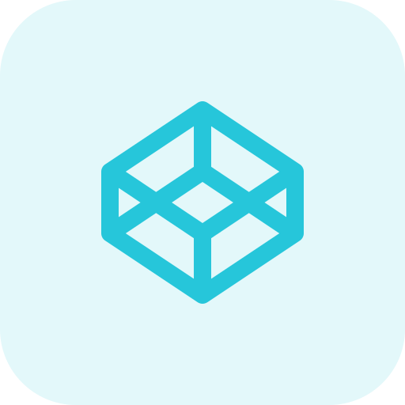

- 👋 Hi, I'm Ajeeth
- 👀 I’m interested in Web Design and Development
- 🌱 I’m currently learning Front-end Development
- 💞️ I’m looking to collaborate on real time web application development
- 😄 Pronouns: **He/Him**
- 📫 Connect with me:  
  

  
  
  
  
  
 
  

  
  

<!--    -->

<!---
iamajeeth/iamajeeth is a ✨ special ✨ repository because its `README.md` (this file) appears on your GitHub profile.
You can click the Preview link to take a look at your changes.
--->
